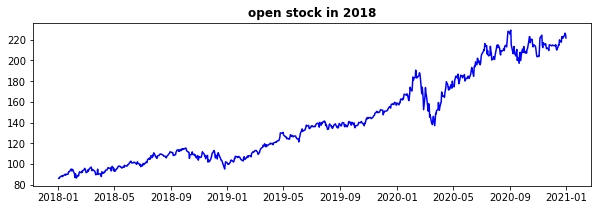
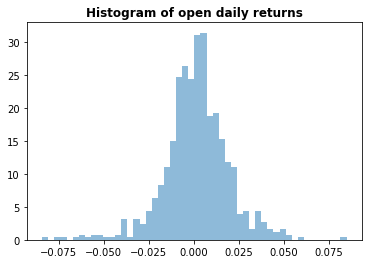
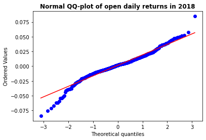
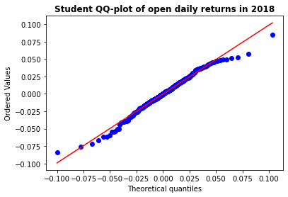
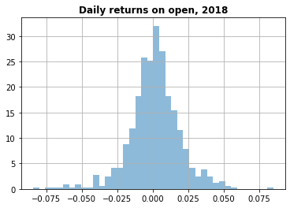
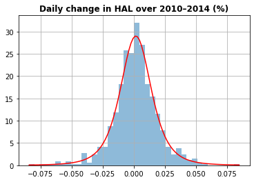

# Overview

In this project, we will examine the Value at Risk calculations and results of a stock withdrawn from the yahoo site at the desired date intervals.

## Introduction

## What is Value at Risk ?

It is a type of statistics that measures and quantifies the level of financial risk in a firm, portfolio or position over a specified period of time. This criterion is most commonly used by investment banks and commercial banks to determine the extent and realization rate of potential losses in their corporate portfolios.
In this study, we will see the 3 methods of VaR calculation and the stages of their use. In this study, Value at Risk measurement has been calculated using *Historical Method*, *The Variance-Covariance Method* and *Monte Carlo Simulation* techniques. 

## Some Assumptions

- Value at Risk calculation for - *The Variance-Covariance Method* assumes that stock returns are normally distributed.
- Monte Carlo simulation refers to any method that generates random trials.

## Approach

In order for the Value at Risk model to work, initially the desired stockname, startdate and enddate variables must be defined. 
Later, the days, startprice, sigma and mu values can be defined and the desired results can be achieved by running the VaRclass.py file after reaching the location.

## Results

- The results.firstgraph () output draws us the historical distribution graph for the stock for which we calculate VaR.



- The results.secondgraph () output draws us the histogram of the open daily returns distribution graph for the stock for which we calculate VaR.



- results.stdperc() output give us the standard deviation value for the stock for which we calculate VaR.
- results.dist_QQ() output draws us the normal QQ plot graph for the stock for which we calculate VaR.



- results.dist_t() output draws us the student t plot graph for the stock for which we calculate VaR.



- results.historicalVaR() output gives us the 0.99, 0.95 and 0.9 confidence interval VaR value and historical VaR graph for the stock for which we calculate VaR.



- results.VaR_Cov() output gives us the covariance VaR value and Covariance VaR graph for the stock for which we calculate VaR.



- results.mcscalcgraph() output draws us the monte carlo sim plot graph for the stock for which we calculate VaR.


- results.mcsrun(10000) gives us the monte carlo simulation results for which we calculate VaR.

In order to use this project, you'll need to install the required python packages:

You can download requirements via "pip install -r requirements"

```bash
pip3 install -r requirements.txt
```

Also you can visit my [Linkedin](https://www.linkedin.com/in/taylan-polat/) or [Github Page](https://github.com/taylan95?tab=repositories)

## References

- [What is Value at Risk ?](https://www.investopedia.com/terms/v/var.asp)
- [Value at Risk with Python](https://risk-engineering.org/VaR/) 